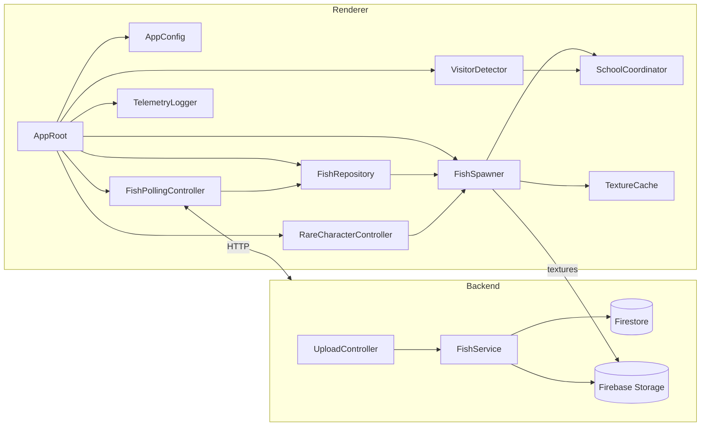

# Architecture

## Scope
- Capture the code-level structure for the interactive aquarium renderer that lives in this Unity project.
- Describe how the renderer talks to the backend API, processes fish assets, reacts to visitor proximity, and keeps telemetry flowing.
- Provide naming and directory conventions so engineers and artists can share the scene without stepping on each other.

## System Overview
The system is split between the Unity renderer (this repository) and a Cloud Run–hosted backend described in `Design Doc.md`. The renderer keeps a small set of controller behaviours that talk to each other through direct references on `AppRoot`. It polls fish metadata from the backend, downloads textures from Firebase Storage, animates fish prefabs inside the presentation scene, and nudges fish toward visitors detected through an OpenCVSharp pipeline. Sentry records runtime issues via a lightweight telemetry helper.

### Runtime Data Flow
1. `AppRoot` loads the active `AppConfig`, pushes its values into the attached controller behaviours, and starts their coroutines.
2. `FishPollingController` hits `/get-fish` every ~30 seconds, normalises the payload, and updates the shared `FishRepository`.
3. `FishRepository` raises events when fish are added, updated, or culled; `FishSpawner` listens and manages prefab instances.
4. `FishSpawner` fetches textures from Firebase Storage, applies hue information, and injects fish into the active `SchoolCoordinator`.
5. `VisitorDetector` runs the OpenCV pipeline on the webcam feed to obtain visitor centroids.
6. `SchoolCoordinator` adapts boids goals using visitor centroids and rare-character attractors.
7. `RareCharacterController` schedules rare spawns and forwards their lifecycle to `FishSpawner`.
8. `TelemetryLogger` forwards structured logs and exceptions to Sentry.

## Unity Renderer Architecture

### Assemblies and Directory Layout
- `Assets/Art/Scripts/App`: bootstrap behaviours (`AppRoot`, editor utilities) and lightweight helpers that hand configuration to other controllers.
- `Assets/Art/Scripts/Fish`: fish domain models (`FishData`, `FishState`), polling controller, repository, spawner logic.
- `Assets/Art/Scripts/Visitors`: visitor detection pipeline, OpenCV wrappers, coordinate transforms.
- `Assets/Art/Scripts/Presentation/Schools`: boids simulation, school coordinator, fish controllers.
- `Assets/Art/Scripts/Rare`: rare-character definitions, spawn handlers, FX triggers.
- `Assets/Art/Scripts/Telemetry`: telemetry logger and Sentry adapter.
- `Assets/Art/Scripts/Infrastructure`: shared HTTP helpers, Firebase texture downloader, configuration utilities.
- `Assets/Art/Configs`: `ScriptableObject` assets for URLs, polling cadence, boids coefficients, rare spawn odds.
- `Assets/Art/Fish`: prefabs, materials, textures (paired with `.meta` files).
- `Assets/Art/Tests/EditMode` & `Assets/Art/Tests/PlayMode`: Unity Test Framework suites covering controller logic and simulation glue.

### Boot Sequence
`AppRoot` is the single MonoBehaviour referenced from the main scene. On `Awake()` it:
1. Reads the active `AppConfig` ScriptableObject to determine endpoints, keys, cadence limits, and telemetry settings.
2. Injects that configuration into referenced controllers (`FishPollingController`, `FishRepository`, `FishSpawner`, `VisitorDetector`, `RareCharacterController`, `TelemetryLogger`) via simple `Initialize` calls.
3. Starts coroutines for polling (`FishPollingController.Run()`), rare character scheduling (`RareCharacterController.Run()`), and periodic telemetry flushing when applicable.
4. Pushes the initial configuration into presentation controllers (`SchoolCoordinator.Initialize()`).

Controllers communicate via direct field references set in the inspector, keeping the scene graph explicit and avoiding runtime service lookup.

### Core Components
| Component | Responsibility | Notes |
| --- | --- | --- |
| `FishPollingController` (MonoBehaviour) | Calls `/get-fish`, handles auth header, retries, and cadence clamping. | Provides `Initialize(AppConfig, FishRepository, TelemetryLogger)` and `IEnumerator Run()`. |
| `FishRepository` (plain C#) | Stores fish data and raises `FishAdded`, `FishUpdated`, `FishRemoved`. | Keeps TTL consistent with backend; exposes `IReadOnlyList<FishState> Snapshot()`. |
| `FishSpawner` (MonoBehaviour) | Instantiates prefabs, applies textures/materials, synchronises with `SchoolCoordinator`. | Subscribes to repository events and reuses pooled prefabs where possible. |
| `FishTextureCache` (plain C#) | Streams textures from Firebase Storage and caches them on disk. | `Task<Texture2D> LoadAsync(FishState state)` throttles concurrent downloads. |
| `VisitorDetector` (MonoBehaviour) | Runs OpenCV pipeline to detect visitor centroids. | Emits `OnVisitorsChanged` events consumed by `SchoolCoordinator`. |
| `SchoolCoordinator` (MonoBehaviour) | Drives boids simulation, blending visitor influence and default schooling. | Offers `ApplyVisitorInfluence(IReadOnlyList<VisitorGroup>)`. |
| `RareCharacterController` (MonoBehaviour) | Schedules rare spawns and routes them through `FishSpawner`. | Exposes `IEnumerator Run()` to manage timers. |
| `TelemetryLogger` (plain C# helper) | Sends events/exceptions to Sentry with minimal setup. | Methods `LogEvent`, `LogException`, `LogBreadcrumb`. |

Controllers remain small and self-contained so EditMode tests can exercise their logic without elaborate setup.

### Fish Domain Model
- `FishDto`: transport shape from the backend (`id`, `imageUrl`, `color`, `createdAt`).
- `FishState`: renderer-facing struct containing Unity `Color`, resolved texture handle, and boids parameters.
- `FishDefinition`: ScriptableObject describing prefab references, default scale, animation clips, renderer materials.
- `FishPalette`: helper to convert the backend hue into material tints; applies HSV-based rules to keep contrast.

`FishRepository` enforces TTL (e.g., drop fish older than the configured window) so the renderer survives stale data if the backend misses a cleanup cycle.

### Texture Pipeline
1. `FishSpawner` requests the fish texture from `FishTextureCache`.
2. The cache first checks an on-disk folder (`FishTextures/`) under `persistentDataPath`; if the file is missing it downloads via `UnityWebRequestTexture`.
3. Textures load asynchronously; each fish shows a placeholder material until the final texture is applied on the main thread.
4. A simple in-memory dictionary prevents re-downloading textures that are already loaded during the current session.

### Visitor Detection Pipeline
- `VisitorDetector` captures frames at 10–15 FPS using `WebCamTexture`.
- Each frame is marshalled to `OpenCvSharp.Mat`, passed through background subtraction, light morphology, and contour detection.
- Contours above an area threshold become candidate visitors; centroids map from camera space to screen space using calibration data stored in a `CameraCalibration` ScriptableObject.
- Nearby centroids are merged with a simple distance threshold to avoid double-counting groups.
- Recent centroid history is smoothed with a short moving average to stabilise boid goals.

### School Coordination & Boids
- Each fish prefab hosts a `FishAgent` MonoBehaviour exposing separation, alignment, and cohesion weights.
- `SchoolCoordinator` iterates over live agents each `Update()`, computing steering forces derived from:
  - Visitor attractors (strong pull within configurable radius).
  - Rare-character attractor (if active).
  - Default waypoint loop to keep motion interesting when no visitors exist.
- The coordinator runs on the main thread; heavy math is isolated in static helper methods to ease testing.
- `BoidSettings` ScriptableObject provides tunable parameters for designers; the coordinator reads the asset every frame to allow live tweaking in the editor.

### Rare Character System
- `RareCharacterController` keeps a spawn interval and weighted list of rare prefabs.
- When triggered, it requests a spawn from `FishSpawner` with flags so `SchoolCoordinator` treats the rare character as an attractor.
- Optional UnityEvents let the scene trigger SFX or screen effects when a rare character appears.

### Logging and Error Handling
- `TelemetryLogger` configures `SentryUnity` during boot with DSN, release, and environment from `AppConfig`.
- Network requests add breadcrumbs (URL, latency, outcome) and send warnings when retries kick in.
- Critical faults (failed texture load, OpenCV init failure) log to both Unity console and Sentry, and can trigger a simple on-screen message handled by `AppRoot`.
- Non-fatal warnings remain as console logs plus Sentry breadcrumbs so frame rate stays unaffected.

### Configuration & Secrets
- `AppConfig` ScriptableObject houses base URL, API key (stored via Unity's `PlayerSettings` or environment variables during builds), poll cadence, rare spawn odds, and boid defaults. Avoid committing real keys.
- For kiosks, maintain separate `AppConfig` asset variants (e.g., staging vs production) and assign the correct one in the scene before building.
- Editor tooling should provide an inspector to update calibration data after projector alignment.

### Testing Approach
- **EditMode**: cover `FishPollingController`'s diff logic (via extracted helper), `FishRepository` TTL/events, and `VisitorDetector` frame processing using recorded clips.
- **PlayMode**: verify `AppRoot` wiring with serialized references, `FishSpawner` prefab lifecycle, and `SchoolCoordinator` behaviour with synthetic visitor feeds.
- Provide deterministic fixtures for fish payloads and recorded webcam frames stored under `Assets/Tests/TestData`.

## Backend Integration Notes
- Renderer authenticates via `X-API-KEY` header; the key is read from environment-specific configuration.
- All HTTP access uses a single `HttpClient` backed by `UnityWebRequest` to reuse connections.
- Polling cadence defaults to 30 seconds but adapts (clamped between 15–60 seconds) based on response headers signaling freshness.
- Backend errors trigger exponential backoff; after `n` consecutive failures the renderer displays cached fish and raises an alert through Sentry.
- The renderer never writes to the backend—only `GET /get-fish` requests and direct Firebase Storage downloads.

## Editor & Build Guidance
- Main scene: `Assets/Art/Scenes/Aquarium.unity`.
- Keep prefabs modular: fish body, fins, and material variants reside under `Assets/Art/Fish`.
- Use Addressables if texture memory pressure grows; `FishSpawner` can be adapted to load addressable prefabs without breaking consumer APIs.
- Build scripts should ensure `AppConfig` references the correct environment before producing binaries in `Builds/`.

## Open Risks & Follow-Up
- OpenCVSharp on macOS/Linux kiosks can require native plugin configuration; test the capture pipeline early.
- Texture download spikes may stall the main thread; consider moving PNG decode to `UnityWebRequestTexture` with async awaits.
- Ensure Firestore TTL and renderer TTL align so orphaned fish disappear predictably.
- Rare-character visual effects may need art direction alignment—placeholder hooks exist but require assets and polish.
