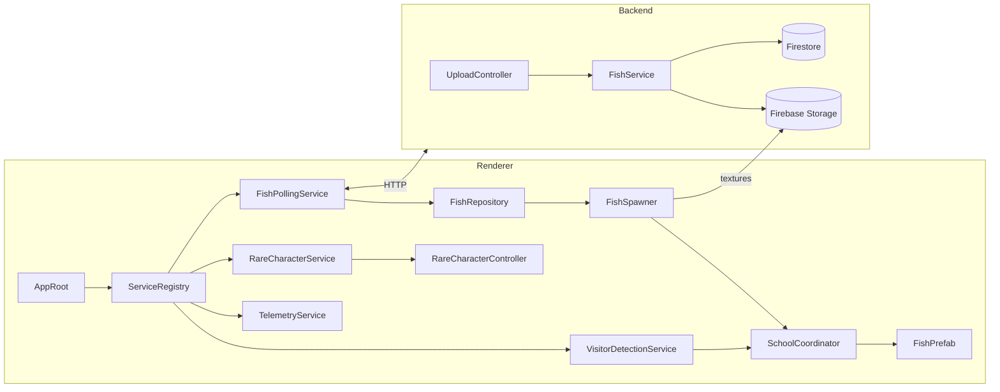

# Architecture

## Scope
- Capture the code-level structure for the interactive aquarium renderer that lives in this Unity project.
- Describe how the renderer talks to the backend API, processes fish assets, reacts to visitor proximity, and keeps telemetry flowing.
- Provide naming and directory conventions so engineers and artists can share the scene without stepping on each other.

## System Overview
The system is split between the Unity renderer (this repository) and a Cloud Run–hosted backend described in `Design Doc.md`. The renderer polls fish metadata from the backend, downloads textures from Firebase Storage, and animates fish prefabs inside a dedicated presentation scene. A webcam feed is analysed locally with OpenCV to pull fish toward detected visitors. Sentry captures runtime issues for both renderer and backend paths.

### Runtime Data Flow
1. `AppRoot` boots the service layer, loads configuration, and spins up coroutines for polling and telemetry.
2. `FishPollingService` hits `/get-fish` every 30 seconds, normalises the payload, and refreshes the `FishRepository`.
3. `FishRepository` raises domain events when fish are added, updated, or culled; `FishSpawner` listens and manages prefabs.
4. `FishSpawner` fetches textures from Firebase Storage, applies hue information, and injects fish into the active `SchoolCoordinator`.
5. `VisitorDetectionService` runs the OpenCV pipeline on the webcam feed to obtain visitor centroids.
6. `SchoolCoordinator` adapts boids goals using visitor centroids and rare-character attractors.
7. `RareCharacterService` schedules rare spawns and forwards their lifecycle to `FishSpawner`.
8. `TelemetryService` forwards structured logs and exceptions to Sentry.

## Unity Renderer Architecture

### Assemblies and Directory Layout
- `Assets/Art/Scripts/App`: bootstrap behaviours (`AppRoot`, `ServiceRegistry`, lifecycle hooks).
- `Assets/Art/Scripts/Domain/Fish`: fish domain models (`FishData`, `FishState`), repository, events.
- `Assets/Art/Scripts/Domain/Visitors`: visitor detection service, OpenCV wrappers, coordinate transforms.
- `Assets/Art/Scripts/Presentation/Schools`: boids simulation, school coordinator, fish controllers.
- `Assets/Art/Scripts/Presentation/Rare`: rare-character definitions, spawn handlers, FX triggers.
- `Assets/Art/Scripts/Infrastructure`: HTTP client, storage downloader, telemetry, config loaders.
- `Assets/Art/Configs`: `ScriptableObject` assets for URLs, polling cadence, boids coefficients, rare spawn odds.
- `Assets/Art/Fish`: prefabs, materials, textures (paired with `.meta` files).
- `Assets/Art/Tests/EditMode` & `Assets/Art/Tests/PlayMode`: Unity Test Framework suites covering services and simulation glue.

### Boot Sequence
`AppRoot` is the single MonoBehaviour referenced from the main scene. On `Awake()` it:
1. Reads the active `AppConfig` ScriptableObject to determine endpoints, keys, and cadence.
2. Creates the `ServiceRegistry` (plain C#), wiring concrete implementations for interfaces such as `IFishApiClient`, `IFishRepository`, `IVisitorDetector`, `ITelemetrySink`.
3. Starts coroutines for polling (`FishPollingService.Run()`), rare character scheduling (`RareCharacterService.Run()`), and telemetry flushing.
4. Pushes the initial configuration into presentation controllers (`SchoolCoordinator.Initialize()`).

To keep the scene lean, no other MonoBehaviour directly executes business logic; they request services from the registry during `Start()` and cache interfaces locally.

### Service Surface
| Service | Responsibility | Key APIs |
| --- | --- | --- |
| `IFishApiClient` (`UnityWebRequest` wrapper) | Calls `/get-fish`, handles auth header, retries, throttling. | `Task<FishDto[]> FetchFishAsync()` |
| `IFishTextureClient` | Streams textures from Firebase Storage via HTTPS and caches to disk in `Application.persistentDataPath`. | `Task<Texture2D> GetTextureAsync(string imageUrl)` |
| `FishPollingService` | Runs timed polls, diffs new vs cached fish, raises repository mutations. | `IEnumerator Run()` |
| `FishRepository` | In-memory store keyed by fish ID; publishes `FishAdded`, `FishUpdated`, `FishExpired`. | `FishState[] Snapshot()` |
| `FishSpawner` | Listens to repository events, instantiates prefabs, applies materials, hooks to `SchoolCoordinator`. | `void OnFishAdded(FishState state)` |
| `VisitorDetectionService` | Manages webcam capture, OpenCV processing, visit centroid smoothing. | `IEnumerator Run()` + `Vector2[] GetVisitorCentroids()` |
| `SchoolCoordinator` | Governs boids goals, pushes forces to `FishAgent` scripts. | `void UpdateSchool(SchoolContext ctx)` |
| `RareCharacterService` | Maintains random schedule, notifies spawner, ensures single active rare character. | `IEnumerator Run()` |
| `TelemetryService` | Wraps `SentrySDK` calls, centralises breadcrumbs and scoped context. | `void TrackEvent(string name, object payload)` |

All services are pure C# objects so that EditMode tests can exercise them without scene loading.

### Fish Domain Model
- `FishDto`: transport shape from the backend (`id`, `imageUrl`, `color`, `createdAt`).
- `FishState`: renderer-facing struct containing Unity `Color`, resolved texture handle, and boids parameters.
- `FishDefinition`: ScriptableObject describing prefab references, default scale, animation clips, renderer materials.
- `FishPalette`: helper to convert the backend hue into material tints; applies HSV-based rules to keep contrast.

`FishRepository` enforces TTL (e.g., drop fish older than the configured window) so the renderer survives stale data if the backend misses a cleanup cycle.

### Texture Pipeline
1. `FishSpawner` requests the fish texture from `IFishTextureClient`.
2. The client checks an on-disk cache folder (`FishTextures/`) beneath `persistentDataPath` before downloading.
3. Textures load asynchronously; `FishAgent` shows a placeholder material until the final texture is applied on the main thread.
4. Texture reuse is reference-counted so multiple fish sharing the same URL do not re-download.

### Visitor Detection Pipeline
- `VisitorDetectionService` captures frames at 10–15 FPS using `WebCamTexture`.
- Each frame is marshalled to `OpenCvSharp.Mat`, passed through background subtraction, morphology, and contour detection.
- Contours above an area threshold become candidate visitors; centroids map from camera space to screen space using calibration data stored in `CameraCalibration` ScriptableObject.
- A simple clustering step merges nearby centroids (DBSCAN with tiny epsilon suffices).
- Recent centroid history is smoothed with an exponential moving average to stabilise boid goals.

### School Coordination & Boids
- Each fish prefab hosts a `FishAgent` MonoBehaviour exposing separation, alignment, and cohesion weights.
- `SchoolCoordinator` iterates over live agents each `Update()`, computing steering forces derived from:
  - Visitor attractors (strong pull within configurable radius).
  - Rare-character attractor (if active).
  - Default waypoint loop to keep motion interesting when no visitors exist.
- The coordinator runs on the main thread; heavy math is isolated in static helper methods to ease testing.
- `BoidSettings` ScriptableObject provides tunable parameters for designers; the coordinator reads the asset every frame to allow live tweaking in the editor.

### Rare Character System
- `RareCharacterService` maintains a weighted list of rare prefabs and a spawn cooldown.
- On activation, it injects the rare prefab through `FishSpawner` with a special tag so `SchoolCoordinator` treats it as an attractor rather than a regular boid.
- The service fires events so UI/HUD scripts can trigger SFX or vignette effects.

### Logging and Error Handling
- `TelemetryService` configures `SentryUnity` during boot with DSN, release, and environment from `AppConfig`.
- Every network request emits breadcrumbs (URL, latency, outcome).
- Critical faults (failed texture load, OpenCV init failure) surface through a central `FatalErrorBus` that can swap the scene to a fallback visual or display guidance to staff.
- Non-fatal warnings stay in the log console and Sentry breadcrumbs to preserve frame rate.

### Configuration & Secrets
- `AppConfig` ScriptableObject houses base URL, API key, poll cadence, rare spawn odds, and boid defaults. The API key is injected at build time via Unity Cloud Build or local environment variables, never committed.
- A `ConfigOverrides.json` file inside `Application.persistentDataPath` enables on-site tweaks without rebuilding; `AppRoot` merges overrides at runtime.
- Editor tooling provides a simple inspector to update calibration data after projector alignment.

### Testing Approach
- **EditMode**: cover `FishPollingService` (diff logic), `FishRepository` (TTL, events), and `VisitorDetectionService` (processing pipeline with recorded frames).
- **PlayMode**: verify `AppRoot` wiring, `FishSpawner` prefab lifecycle, and `SchoolCoordinator` integration with synthetic visitor feeds.
- Provide deterministic fixtures for fish payloads and recorded webcam frames stored under `Assets/Tests/TestData`.

## Backend Integration Notes
- Renderer authenticates via `X-API-KEY` header; the key is read from environment-specific configuration.
- All HTTP access uses a single `HttpClient` backed by `UnityWebRequest` to reuse connections.
- Polling cadence defaults to 30 seconds but adapts (clamped between 15–60 seconds) based on response headers signaling freshness.
- Backend errors trigger exponential backoff; after `n` consecutive failures the renderer displays cached fish and raises an alert through Sentry.
- The renderer never writes to the backend—only `GET /get-fish` requests and direct Firebase Storage downloads.

## Editor & Build Guidance
- Main scene: `Assets/Art/Scenes/Aquarium.unity`.
- Keep prefabs modular: fish body, fins, and material variants reside under `Assets/Art/Fish`.
- Use Addressables if texture memory pressure grows; `FishSpawner` can be adapted to load addressable prefabs without breaking consumer APIs.
- Build scripts should ensure `AppConfig` references the correct environment before producing binaries in `Builds/`.

## Open Risks & Follow-Up
- OpenCVSharp on macOS/Linux kiosks can require native plugin configuration; test the capture pipeline early.
- Texture download spikes may stall the main thread; consider moving PNG decode to `UnityWebRequestTexture` with async awaits.
- Ensure Firestore TTL and renderer TTL align so orphaned fish disappear predictably.
- Rare-character visual effects may need art direction alignment—placeholder hooks exist but require assets and polish.

