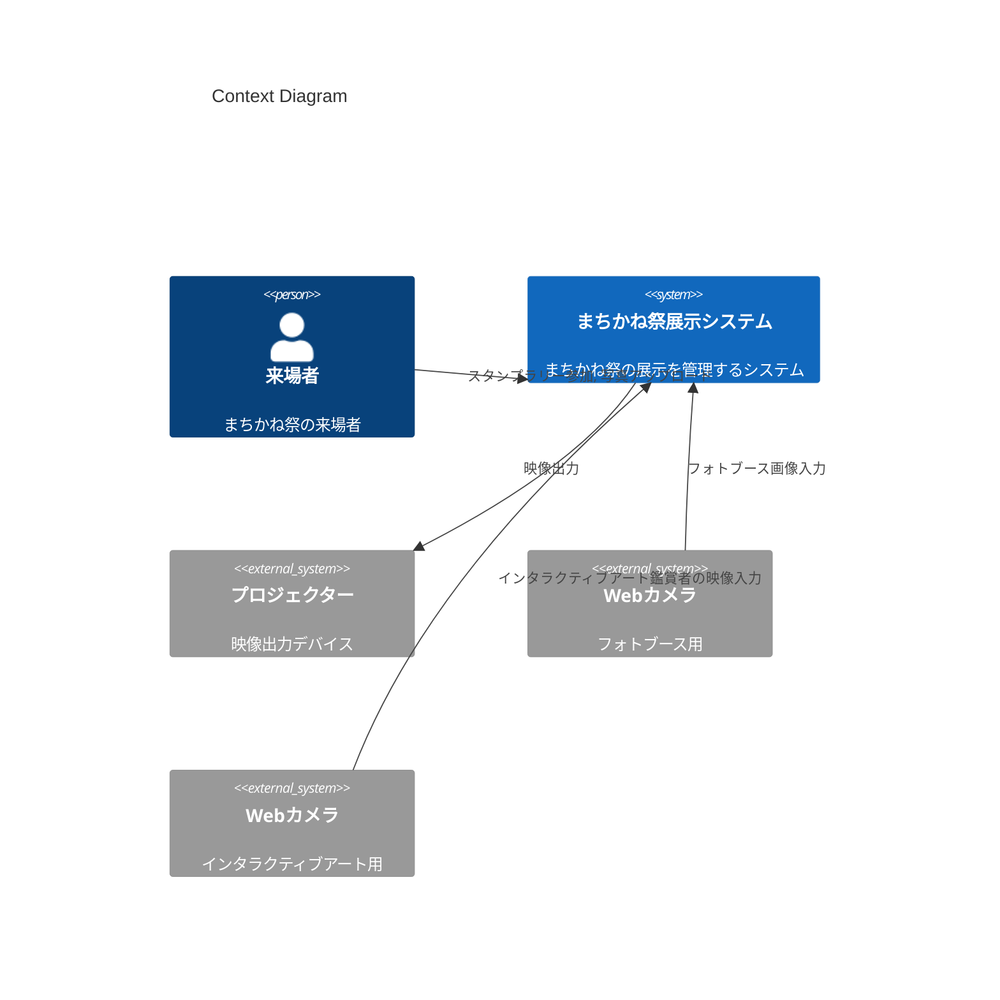
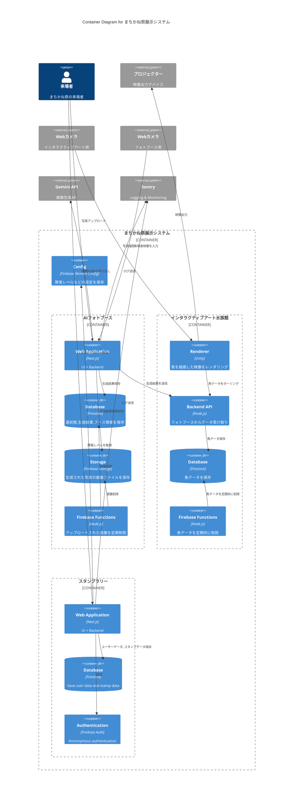

Status: in-review
Authors: ゆにねこ
Reviewers: nagomu
Updated: 2025/10/11

---
* スタンプラリー: [[./stamp/Design Doc]]
* AIフォトブース: [[./photobooth/Design Doc]]
* インタラクティブアート水族館: [[./interactive/Design Doc]]
---
# Objective
2025年まちかね祭展示を開発する。
# Background
まちかね祭とは、大阪大学で年に一度開催される大学祭である.
当プロジェクトは 2025年に GDG on Campus Osaka が出展する展示を開発することを目的とする.
# Goals / Non-goals
## Goals
* AIフォトブースを開発する
* インタラクティブアートを開発する
* スタンプラリーシステムを開発する
## Non-goals
* 喋るロボットを開発する
* Locallization (英語)
# Architecture
* 各展示ごとの簡易的なマイクロサービスで実装する.
  Next.js や Backend API を分割し、URLでアクセスするサービスを分ける.
## Diagram
### Context Diagram

### Container Diagram

# Security Considerations
* AIフォトブースのDBは匿名認証したユーザーのみそのユーザーのデータだけ読み書き可能にする。
* AIフォトブースのUIは運営のみがアクセスできるようにする。事前にFirebase Authでメールアドレス&パスワードでユーザーを作成し、そのユーザーのみがログインできるようにする。
* スタンプラリーページから正規のユーザーがインタラクティブアートに画像をアップロードしたことをどう保証するか？
## Threat Model
## Authentication & Authorization
## Data Protection
## Secure Coding
### Input Validation
* NFCタグIDは事前に登録されたもののみ受け付ける
* AIフォトブースにアップロードする画像は JPEG/PNG 形式のみ、サイズは20MB以下に制限する
### Logging and Monitoring
* クライアントサイドのロギングは Sentry の無料プランで行う.
  無料プランは管理画面が1ユーザーしか使えないため、共有アカウント gdsc.osaka@gmail.com を使用する.
  https://sentry.io/pricing/
* Firebase Analytics でアクセス解析を行う.
## Incident Response
* まちかね祭運営日には必ず開発者が一人以上常駐し、障害対応できるようにする
* 開発者以外が障害を確認した場合、全ての開発者をメンションして Discord で報告する
* 障害対応手順:
	* Sentry と Google Cloud Logging を確認
	* データベースを確認
	* データの不具合の場合は手動でデータベースを書き換え
	* コードの不具合の場合はコードを修正してデプロイ
* 障害時は Twitter で障害発生と復旧を報告する
* 障害のレベルごとにアプリの表示を変える. 障害レベルは FIrebaes Remote Config で設定する
	* 軽微な障害 (特定機能の一時的な障害): 発生している障害をスタンプラリーページの目立つところに表示する
	* 重大な障害 (アプリを使用できないレベル): 障害対応中ページを表示する
# Privacy Considerations
* フォトブースにアップロードした画像は、画像生成時または一定時間経過後に自動で削除する。
* 生成された画像は一定時間経過後に非公開にする。データは削除しない。
## Data Minimization & Purpose Limitation
## Transparency and User Control
## Data Handling and Processing
* 認証情報とロギング情報は紐付けない
## Data Sharing and Third Parties
## Compliance
# Open issues
* 認証情報とロギング情報は紐付けないのはなぜですか。
	* ==紐づけた方がいいですね。ドキュメントを書いている途中に logging の方法を変えたので、ドキュメントが古いままになっていました。==
* スタンプラリーページ、画像ダウンロードページは別ページで作成だと思いますが、ページ間移動のタブは無しで大丈夫ですよね。
	* ==大丈夫です。詳細は [[./stamp/Design Doc]] 参照==