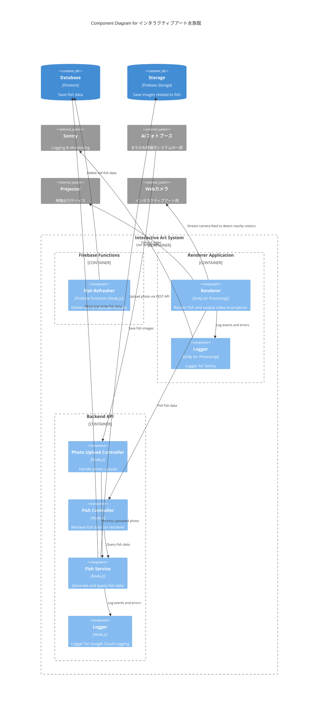

Status: draft
Authors: ゆにねこ
Reviewers: 
Updated: 2025/10/11
# Objective
2025年まちかね祭展示の伊ンタラクティブアート水族館を開発する
# Background
# Goals / Non-goals
## Goals
* プロジェクターで水族館 (魚) を投影する
* AIフォトブースで生成された画像ごとに魚を追加する
* 魚の模様の一部に生成された画像を貼り付ける
* スクリーン付近をカメラで撮影し、スクリーンの近くに来た来場者の近くに魚を集まらせる
* 稀にレアキャラ (ワニ博士など) をスクリーンに描画する
## Non-goals
* 動的に音楽を再生する
* えさやり
* 魚が逃げるトリガーを設定
# Architecture
* Backend API は Cloud Run にデプロイし,  Firebase Hosting の rewrites を用いて **art.fes2025.gdsc-osaka.jp** で公開する
* フォトブースで画像が追加される頻度は高々1分に2枚程度と予想されるため, WebSocketではなくポーリングで魚データを取得する
## Diagram
### Component Diagram (C3)

### Code Diagram (C4)
```typescript
interface FishService {
	getAllFish(): ResultAsync<Fish[], DBError | StorageError>;
	addFish(photo: Buffer): ResultAsync<void, DBError | StorageError>;
}
```
## Data Model
### Firestore
```yaml
fishs:
	(fishId):
		imageUrl: string # URL of the fish image in Firebase Storage
		imagePath: string # Path of the fish image in Firebase Storage
		color: string # Color of the fish in HEX format
		createdAt: Timestamp # Creation timestamp
```
### Firebase Storage
```yaml
fish_images:
	(fishId):
		fish.png # Fish image
```
## API Specification
```yaml
openapi: 3.0.0
info:
	title: インタラクティブアート水族館 Backend API
	version: 1.0.0
paths:
	/upload-photo:
		post:
			summary: Upload a photo to generate fish data
			security:
				- apiKeyAuth: []
			requestBody:
				required: true
				content:
					multipart/form-data:
						schema:
							type: object
							properties:
								photo:
									type: string
									format: binary
									description: The photo file to upload
			responses:
				'200':
					description: Photo uploaded successfully and fish data generated
				'400':
					description: Bad request (e.g., missing photo)
				'500':
					description: Internal server error
	/get-fish:
		get:
			summary: Get fish data for rendering
			security:
				- apiKeyAuth: []
			responses:
				'200':
					description: Successful response with fish data
					content:
						application/json:
							schema:
								type: array
								items:
									$ref: '#/components/schemas/Fish'
				'500':
					description: Internal server error
components:
	securitySchemes:
		apiKeyAuth:
			type: apiKey
			in: header
			name: X-API-KEY
	schemas:
		Fish:
			type: object
			properties:
				id:
					type: string
					description: The fish ID
				imageUrl:
					type: string
					description: URL of the fish image
				color:
					type: string
					description: Color of the fish in HEX format
```
## Tech Stack
* Backend API: Node.js, Hono.js, neverthrow, obj-err, Firebase Admin SDK, Google Cloud Logging, Sentry
* Renderer: Unity, Sentry
	* 物理演算, 3D拡張の容易さ, Asset store のプラグインの豊富さから Unity を選択
## Renderer Implementation Details
### 1. 3D Modeling で魚のアニメーション
Blenderで魚の3Dモデルを作成し、Unityにインポートしてアニメーションを設定する。
### 2. 来場者付近に魚を集める
1. Webカメラでスクリーン付近の映像を取得
2. [OpenCVSharp](https://github.com/shimat/opencvsharp) を用いて映像から背景差分や輪郭検出を行い、来場者の位置を特定
3. 来場者の位置をカメラの映像座標からスクリーン座標に変換
4. Boids アルゴリズムを用いて魚の群れをシミュレーションし、来場者の近くに魚を集める

来場者が複数いる場合は、距離が近い来場者をグループ化し、各グループの中心に魚を集める。
例 (A: 来場者, -: 空白)
* ----A---- -> A の位置に魚を集める
* -AAA----- -> AAA の中心に魚を集める
* -AAA--AA- -> AAA と AA の2グループに分けて各グループの中心に魚を集める
* -AAAAAAA- -> AAAAAAA の中心に魚を集める
### 3. 魚データ取得とテクスチャ変更
30秒ごとに魚データをポーリングし、新しい魚データがあれば、魚を追加する。
魚のテクスチャには Firebase Storage に保存された画像を使用する。
#### 色抽出のアルゴリズム
1. 画像を HSV 色空間に変換する
2. 彩度、明度が閾値以下のピクセルを除外する (不安定な Hue を除外するため)
3. Hue チャンネルのヒストグラムを計算する
4. 一定範囲ごとに量子化する (例: -5~5, 5~15, ..., 355~365)
5. ヒストグラムの最頻値を取得し、その Hue 値を使用する
### 4. レアキャラ実装
定期的に乱数を生成し、一定確率 (例: 1%) でレアキャラを出現させる。
レアキャラ出現時には、効果音や画面エフェクトを追加して目立たせる。魚は表示したままにする。
# Security Considerations
## Threat Model
## Authentication & Authorization
* Fish Controller, Photo Upload Controller は API キー認証を行う.
  送信された API キーと環境変数に保存された API キーを比較し, 一致すれば認証成功とする.
* イベント自体が3日間と短いため、セキュリティリスクより開発コストと利便性を優先してAPIキー認証を採用する。
## Data Protection
* Firebase には Admin SDK のみからアクセスするため Security Rules は考慮しない.
## Secure Coding
### Input Validation
* ユーザーがAPIにリクエストを送信することはないため, 特に入力検証は行わない.
### Logging and Monitoring
* バックエンドのログは Google Cloud Logging に送信する.
* Renderer クライアントのログは Sentry に送信する.
# Privacy Considerations
## Data Minimization & Purpose Limitation
* 来場者の顔が魚に映らないよう, フォトブースから送信された画像にぼかし処理をして、顔を隠す.
## Transparency and User Control
## Data Handling and Processing
## Data Sharing and Third Parties
## Compliance
# Open Issues
* AIフォトブースの生成結果をinteractiveのbackend apiに送信して、userごとの魚オブジェクトを保存するかんじですが、userそれぞれの色を抽出して様々な色の魚ではなく、写真が体に貼られた魚を生成するならRGBを抽出するというのは無しの方向ですか？
	* ==RGB抽出忘れてました。HSV色空間で最も頻度の高いHueを取り出すアルゴリズムにしましょうか。==
* 魚オブジェクトの写真の顔を隠すシステムはどう実装しますか？
	* 画像生成 -> 顔の画像認識 -> 顔にあたる箇所にモザイクorクリップ -> interactive/backend api とかですか？
	* ==画像全体にぼかし処理をする程度にしようかなーと思っています==