Status: draft
Authors: ゆにねこ
Reviewers: nagomu
Updated: 2025/10/11
# Objective
2025年まちかね祭展示のフォトブースに必要なシステムを実装する.
# Background
# Goals / Non-goals
## Goals
1. ユーザーは会場内のカメラで自身を撮影できる
2. 撮影中はカメラの映像をディスプレイに表示する
3. ユーザーはスマートフォンから筐体ごとに写真をアップロードできる
4. ユーザーはタッチパネルで選択肢を選べる
	1. Location: 場所, 旅行先
	2. Outfit: 服装
	3. Person: ツーショットする人
	4. Style: 写真のスタイル (e.g. セピア)
	5. Pose: ポーズ (e.g. ピース)
5. システムは 2,3の画像と4の選択肢から写真を生成し, 写真とQRをディスプレイに表示する
6. ユーザーは QR コードを読み込んで生成した写真をダウンロードできる
7. ユーザーは写真をフォトフレーム付きでチェキで印刷できる
## Non-goals
1. ユーザー認証
2. ユーザーはコードを入力して生成した写真を後からダウンロードできる
3. 写真生成時に音楽も生成する
4. ユーザーはチェキのフォトフレームを選択できる
5. ユーザーは写真をSNSにシェアできる
6. 音声ガイド (UIと物理的な案内で完結させる)
7. スタンプラリーに写真のダウンロードサイトへのリンクを一応載せておく
# Architecture
* Web Application は Firebase App Hosting に **photo.fes2025.gdsc-osaka.jp** でホスティングする
## Diagram
* チェキ印刷方法
	* 担当者が Photos Page を開いて待機
	* 来場者が印刷を希望する場合、Photos Page の画像をダウンロードし、チェキプリンターで印刷する
	* フォトフレームは Photos Page で追加する
* カメラ映像と撮影
	* Webcam はディスプレイを投影している端末 (端末A) に接続する
	* ControlPage で撮影ボタンが押された瞬間に lastTakePhotoAt を更新し、Webcamが撮影してアップロードする
* ユーザーによる画像アップロード
	* Upload Photo API からアップロードされた画像は対応するフォトブースに登録される
	* フォトブースで写真が一度でも使用されたら、該当する写真データはDB・ストレージから削除される
	* 写真が使用されなかった場合、15分後に削除される
* 生成された画像の定期削除は実装しない
	* イベント自体が3日間と短いため、削除は手動で行う
	* 代わりに、Download Page でダウンロードできる有効期限を設定する
	  有効期限は24時間とする
### Component Diagram (C3)
* Middleware で認証しリダイレクトしたいので, トークンで管理者認証を行う

```mermaid
C4Component
title Component Diagram for まちかね祭AIフォトブース
Container(auth, "Authentication", "Firebase Auth", "運営認証 + 匿名認証")
ContainerDb(db, "Database", "Firestore", "生成画像, 選択肢, ブース情報を保存")
ContainerDb(storage, "Storage", "Firebase Storage", "Save uploaded images and generated photos")
%% ContainerDb(realtime, "Realtime Database", "Firebase Realtime Database", "Sync photo booth device state in real-time") %%
System_Ext(sentry, "Sentry", "Logging & Monitoring")
System_Ext(webcam, "Webカメラ", "フォトブース用")
System_Ext(art, "インタラクティブアート水族館", "まちかね祭展示システムの一部")
System_Ext(gemini, "Gemini API", "画像生成API")

Container_Boundary(app, "AIフォトブースシステム") {
	Container_Boundary(ui, "UI") {
		Component(control_page, "Control Page", "Next.js", "Customer UI to take photos, select images, choose options, and start generation")
		Component(display_page, "Display Page", "Next.js", "Display camera feed and generated photo with QR code")
		Component(download_page,  "Download Page", "Next.js", "Download generated photo via QR code")
		Component(admin_page, "Admin Page", "Next.js", "Admin UI to set photo booth device info and link to other pages")
		Component(login_page, "Login Page", "Next.js", "Admin UI to login with token and redirect to admin_page")
		Component(photos_page, "Photos Page", "Next.js", "Admin UI to view current generated photos")
		Component(notfound_page, "NotFound Page", "Next.js", "Show 404 not found message")
	}
	
	Component(auth_service, "Auth Service", "Next.js", "Manage token-based authentication for admin or check auth user")
	Component(photo_service, "Photo Service", "Next.js", "Upload photos and retrieve them")
	Component(booth_service, "Booth Service", "Next.js", "Manage photo booth device state and info")
	Component(generation_service, "Generation Service", "Next.js", "Manage generation and retrieval of generation photos")
	Component(logger, "Logger", "Next.js", "Log requests and errors")
	Component(middleware, "Middleware", "Next.js", "Handle admin token verification")
	Component(upload_photo_api, "Upload Photo API", "Next.js", "Handle photo upload")
	Component(photo_cleaner, "Photo Cleaner", "Firebase Functions (Node.js)", "Delete old uploaded photos periodically")
	Rel(photo_cleaner, db, "Delete old photo metadata")
	Rel(photo_cleaner, storage, "Delete old photo files")
	
	Rel(middleware, auth_service, "Verify admin token")
	Rel(control_page, booth_service, "Get and update photo booth device state")
	UpdateRelStyle(control_page, booth_service, $offsetY="-100")
	Rel(control_page, generation_service, "Get generation options and start photo generation")
	UpdateRelStyle(control_page, generation_service, $offsetY="-80")
	Rel(display_page, booth_service, "Stream photo booth device state")
	UpdateRelStyle(display_page, booth_service, $offsetY="-60")
	Rel(display_page, photo_service, "Get image sources and upload a photo taken")
	UpdateRelStyle(display_page, photo_service, $offsetY="-40")
	Rel(download_page, generation_service, "Get generated photo")
	UpdateRelStyle(download_page, generation_service, $offsetY="-20")
	Rel(admin_page, booth_service, "Get booth by id")
	Rel(upload_photo_api, photo_service, "Upload photo from スタンプラリーシステム")
	Rel(login_page, auth_service, "Login and get admin auth token")
	Rel(photos_page, photo_service, "View current generated photos")
	
	Rel(photo_service, db, "Read and write photo metadata and generation options")
	UpdateRelStyle(photo_service, db, $offsetY="-80")
	Rel(photo_service, storage, "Upload and download images")
	UpdateRelStyle(photo_service, storage, $offsetY="-60")
	Rel(photo_service, auth_service, "Verify that requested user is authenticated")
	%% Rel(booth_service, db, "Read and write photo booth device info, and sync photo booth device state in realtime") %%
	%% UpdateRelStyle(booth_service, db, $offsetY="-40") %%
	Rel(generation_service, db, "Read generation options")
	UpdateRelStyle(generation_service, db, $offsetY="20")
}

Rel(logger, sentry, "Send logs and errors to Sentry")
Rel(auth_service, auth, "Use Firebase Admin Auth API")
Rel(control_page, webcam, "Stream camera feed using WebRTC")
UpdateRelStyle(control_page, webcam, $offsetY="40")
Rel(display_page, webcam, "Stream camera feed using WebRTC")
UpdateRelStyle(display_page, webcam, $offsetY="20")
Rel(generation_service, art, "Send generated photo")
Rel(generation_service, gemini, "Use Gemini API to generate photos")
```

### Code Diagram (C4)
```typescript
interface AuthService {
	verifyIdToken(idToken: string): ResultAsync<User, FirebaseAuthException>;
	verifyAdminToken(token: string): ResultAsync<void, AuthException>;
	signInWithAdminToken(token: string): ResultAsync<SignInResult, AuthException>;
}

interface SignInResult {
	customToken: string; // Firebase Custom Token
}
```

```typescript
interface PhotoService {
	uploadUserPhoto(file: File): ResultAsync<UploadedPhoto, PhotoUploadException>;
	getUploadedPhotos(boothId: string): ResultAsync<UploadedPhoto[], PhotoNotFoundException>;
}
```

```typescript
interface BoothService {
	getBoothById(boothId: string): ResultAsync<Booth, BoothNotFoundException>;
	updateBooth(boothId: string, data: Partial<Booth>): ResultAsync<void, BoothUpdateException>;
	streamBoothState(boothId: string, callback: (state: BoothState) => void): Unsubscribe;
}
```

```typescript
interface GenerationService {
	getOptions(): ResultAsync<GenerationOption[], GenerationOptionException>;
	startGeneration(boothId: string, photo: Photo, options: SelectedOptions): ResultAsync<GeneratedPhoto, GenerationException>;
	getGeneratedPhoto(photoId: string): ResultAsync<GeneratedPhoto, PhotoNotFoundException>;
}
```
## Data Model
### Firestore
* camelCase を使う
```yaml
booths:
	(boothId):
	    state: string # idle, menu, capturing, generating, completed
	    latestPhotoId?: string # last generated photo ID, optional
	    lastTakePhotoAt?: Timestamp
		createdAt: Timestamp
	generatedPhotos:
		(photoId):
			imageUrl: string
			imagePath: string
			createdAt: Timestamp
	uploadedPhotos: # uploaded photos from users or booths
		(photoId):
			imageUrl: string
			imagePath: string
			createdAt: Timestamp
options:
	(optionId):
		typeId: string # location, outfit, person, style, pose
		value: string
		displayName: string
		imageUrl?: string # optional
		imagePath?: string # optional
		createdAt: Timestamp
		updatedAt: Timestamp
```
### Firebase Storage
```yaml
photos:
	(photoId):
		photo.png # Uploaded photo from user or booth
generated_photos:
	(photoId):
		photo.png # Generated photo
```
## API Specification
```yaml
openapi: 3.0.0
info:
	title: まちかね祭AIフォトブース Backend API
	version: 1.0.0

paths:
  # /upload-photo
  # multipart/form-data で photo ファイルを受け取り, 200 or 403 or 500 を返す
  # Authorization: Bearer <Firebase ID Token>
  /upload-photo:
		post:
			summary: 来場者が画像をファイル+ブースIDでアップロードする
			security:
				- firebaseAuth: []
			requestBody:
				required: true
				content:
					multipart/form-data:
						schema:
							type: object
							properties:
								photo:
									type: string
									format: binary
									description: The photo file to upload
								boothId:
									type: string
									description: The photo booth ID
			responses:
				'200':
					description: Photo uploaded successfully
				'403':
					description: Forbidden (e.g., invalid token)
				'500':
					description: Internal server error
components:
	securitySchemes:
		firebaseAuth:
			type: http
			scheme: bearer
			bearerFormat: JWT
```
## Tech Stack
* Frontend: Next.js, shadcn/ui, Tailwind CSS, jotai
* Backend: Next.js API Routes + Server Actions, neverthrow
* BaaS: Firebase Auth, Firestore, Firebase Storage, Firebase App Hosting, Firebase Functions, Firebase Analytics
## UI
用語集
- ナビゲーション: `<link/>` による遷移
- リダイレクト: JavaScript による遷移

| Page          | URL                                           | Description                                                                                                                                                                                                                                                                     |
| ------------- | --------------------------------------------- | ------------------------------------------------------------------------------------------------------------------------------------------------------------------------------------------------------------------------------------------------------------------------------- |
| Control Page  | /control?boothId=(boothId)                    | **アクセス方法**<br>Admin Page からナビゲーション<br><br>**ページ動作**<br>ブースの状態に応じて表示内容を変える<br>- idle: フォトブースを始めるのボタンを表示<br>- menu: 画像選択、写真撮影開始、選択肢を表示<br>- capturing: 写真撮影のカウントダウンを表示。ページ遷移から N 秒後に写真を撮影<br>- generating: AIが写真を生成中・・・のメッセージとQRコードを表示<br>- completed: Download Page への QR コードを表示 |
| Display Page  | /display?boothId=(boothId)                    | **アクセス方法**<br>Admin Page からナビゲーション<br><br>**ページ動作**<br>ブースの状態に応じて表示内容を変える<br>- idle: タッチパネルをタップしてね のメッセージを表示<br>- menu: Control Page の操作ガイドを表示<br>- capturing: Webカメラの映像を表示<br>- generating: AIが写真を生成中・・・のメッセージを表示<br>- completed: 生成した写真を表示                                    |
| Download Page | /download?boothId=(boothId)&photoId=(photoId) | **アクセス方法**<br>Control Page の QRコードからアクセス<br><br>**ページ動作**<br>生成した写真, ダウンロードボタンを表示<br>ダウンロードボタンを押すと、生成した写真をダウンロードする                                                                                                                                                              |
| Admin Page    | /admin                                        | **アクセス方法**<br>Login Page からリダイレクト<br><br>**ページ動作**<br>- boothId の input<br>- Control Page へのリンク<br>- Display Page へのリンク<br>- Photos Page へのリンク<br>を表示                                                                                                                           |
| Login Page    | /login                                        | **アクセス方法**<br>URL直接入力<br><br>**ページ動作**<br>1. input にトークンを入力して submit する<br>2. Cookieにトークンが保存される<br>3. Server Actions から AuthService でログインする<br>4. ログイン成功 -> Admin Page へリダイレクト<br>    ログイン失敗 -> エラーメッセージ表示                                                                      |
| Photos Page   | /photos                                       | **アクセス方法**<br>Admin Page からナビゲーション<br><br>**ページ動作**<br>各ブースの最も最近生成された画像を表示する<br>(ページの目的 = チェキプリンターへの手動の印刷命令)                                                                                                                                                                    |
| NotFound Page | /404                                          | **アクセス方法**<br>Adminのみログインできるページに未認証のユーザーがアクセスした場合にリダイレクト<br><br>**ページ動作**<br>404 Not Found のメッセージ表示                                                                                                                                                                             |
|               |                                               |                                                                                                                                                                                                                                                                                 |
# Security Considerations
## Threat Model
## Authentication & Authorization
* 管理者認証は事前に発行した UUID トークンを SHA256 ハッシュ化したものを用いる.
  トークンは SHA256 ハッシュ化したものを環境変数に入れておく.
  管理者間ではトークンをそのまま共有する.
* ソルトは環境変数で管理し、Tech Lead が管理する.
* 管理者が Login Page でトークンを入力すると Cookie にトークンが保存され, server actions から AuthService でログインする.
  正常にログインできたら, createCustomToken で取得したトークンを返し, クライアントサイドで signInWithCustomToken で認証する.
* middleware で Cookie の SHA256 ハッシュ値と環境変数の SHA256 ハッシュ値を比較し, 一致すれば認証成功とする.
  一致しなければ Error Page にリダイレクトする.
* Login Page, Error Page 以外は管理者認証が必要.
* Upload Photo API はスタンプラリーシステムからのリクエストのみ受け付ける.
  Firebase Admin SDK で Firebase Auth のユーザーからのリクエストかを確認する.
## Data Protection
* Firestore, Firebase Storage は Security Rules で Custom Claim 認証を使用する
* サーバーサイドで createCustomToken で管理者用トークンを生成し, クライアントで signInWithCustomToken で認証する
* 管理者認証したユーザーのみが管理者用のデータにアクセスできるようにする
## Secure Coding
### Input Validation
* アップロードされた画像はサーバー側で再エンコードして保存する
### Error Handling
*
## Incident Response
# Privacy Considerations
## Data Minimization & Purpose Limitation
## Transparency and User Control
## Data Handling and Processing
## Data Sharing and Third Parties
## Compliance
# Open Issues
* photoboothの写真撮影後のpreviewとQRどっちもディスプレイに表示しますか。preview大きく見せるならQRはタブレット側でもいいのかなと。システム的に厳しいなら両方ディスプレイでも可。
	* > そうですね、QRをタブレットにしましょう
* チェキ関連について
	* 少し認識がずれていたのですが、フォトブースでリアルタイムに映っているAI加工済みの写真をチェキ風に印刷するなら、私が持っているチェキカメラは使えないです。（私の持っているチェキは、カメラ型で撮影したらすぐにチェキが出てくるやつ。データでどこかに転送されるやつではない）
	* 持ってるやつです -> [チェキカメラ](https://www.fujifilm.com/jp/ja/consumer/support/instax/mini40/specifications)
	* discoにセサミストリートを被験者にした画像貼っときます
		* もしこのチェキ使うなら、このチェキを貼る用紙などをオリジナルGDG仕様で用意してそこに貼る
		* けどAI要素がなくなるから厳しいかもですね。レンタルした元がとれるかどうか、、
		* チェキ風印刷ができるやつレンタルしますかどうしますか。
	* ==なるほどー、となるとレンタルが必要そうですね・・・==
* 写真の縦横比はどうしますか？撮影後に表示する際に、縦横比に応じてレイアウトを変更？
	* 生成後の画像のみ、縦横比を固定する？
	* 元の写真のトリミングは不要かも？
* ユーザーの全身を映すなら、写真は縦長？となると、現地で写真撮影する際は Webcam は厳しい？
* タッチパネルの破壊・盗難対策
	* 電源から外れたらブザーを鳴らす？
		* 接触不良で外れた時も鳴ってうるさいかも
	* 机の上に段ボールを固定して、タブレットをその中に入れることで、埋め込みディスプレイ的にする？
* 写真を複数枚生成してもいいかも？
	* 納得のいく写真を選んで保存 or 全部アップロード
* 写真をアップロードするために何らかの方法でスマホを識別する必要？(そのためのページ・API を追加？)
	* NFC タグにタッチ？