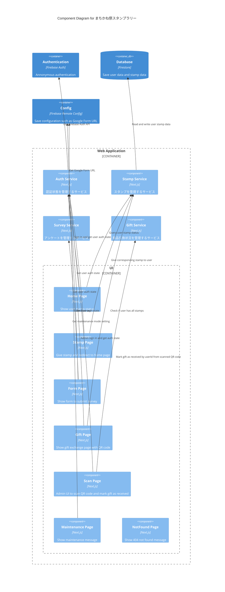

Status: draft
Authors: ゆにねこ
Reviewers: nagomu
Updated: 2025/10/16
# Objective
2025年まちかね祭展示のスタンプラリーシステムを開発する。
# Background
# Goals / Non-goals
## Goals
* ユーザーはWebサイトアクセス時に匿名認証する
* ユーザーは下記のときにスタンプを獲得できる
	* 受付でNFCタグを読み込んだ時
	* フォトブースでNFCタグを読み込んだ時
	* インタラクティブアートでNFCタグを読み込んだ時
	* ロボット展示でNFCタグを読み込んだ時
	* アンケートに回答した時
* ユーザーはスタンプ獲得状況をWebサイトで確認できる
* ユーザーはスタンプをすべて集めたら景品引換のページを表示できる
* ユーザーはAIフォトブースに画像をアップロードできる
* 管理者はパスワード認証でAdmin認証できる
* 管理者は Gift Page の QR コードを読み取って、ユーザーを景品受け取り済みにできる
* 来場者向けページは日本語・英語で同等の情報を表示する（言語切り替えスイッチ付き）
* 各ページはスタンプ取得〜景品受け取り導線で体感 2 秒以内の応答を保つ
## Non-goals
# Architecture
* Web Application は Firebase App Hosting に **fes2025.gdsc-osaka.jp** でホスティングする
* NFCタグには事前に URL を登録しておき、URL にアクセスしたユーザーがスタンプを獲得できる
	* URL例: **https://fes2025.gdsc-osaka.jp/stamp?type=reception
* アンケートフォームは Web App 内で実装し、Submit 時に Next.js Route Handler を経由して Google Form に回答結果を送信する
	* Route Handler で匿名ユーザーIDを付与し、成功/失敗を Firestore に記録する
	* Google Form の URL は Firebase Remote Config で管理する
	* https://qiita.com/TKfumi/items/d8924f6ffa6e40675ce4
* アンケートでは以下の情報を収集する
	* userId: Firebase Auth の Annonymous Login で発行される UID. Input 自体は表示せず、 Google Form に送信するときに付与する.
	* AIフォトブースの満足度 (5段階評価)
	* インタラクティブアートの満足度 (5段階評価)
	* スタンプラリーの満足度 (5段階評価)
	* 自由記述欄
* アンケート回答後に Gift Page にアクセスすると、景品引換ページと QR コードを表示する
	* QRコードには userId 情報と署名ハッシュを含め、Canvas でクライアント生成する
	* 運営が QR コードを読み取ると、当該ユーザーが景品受け取り済みになる
* Remote Config の障害レベルに応じて参加者ページは `/maintenance` に誘導し、スキャンページのみホワイトリストでアクセスを許可する

## Operational Constraints
* スタンプ付与 API（`/api/stamps/award`）の p95 レイテンシーは 300ms 以下
* ホームページの First Meaningful Paint は キオスク端末（Chromium ベース）で 2 秒以内
* QR コードの有効期限は生成から 2 時間（Remote Config で調整可能）
* Maintenance モードでは `/scan` のみアクセス可能（遠隔で解除・ホワイトリスト制御）

## Diagram
### Component Diagram (C3)

### Code Diagram (C4)
```typescript
interface AuthService {
	signInAnonymously(): ResultAsync<User, FirebaseAuthException>;
	getCurrentUser(): User | null;
}
```

```typescript
interface StampService {
	getStampStatus(userId: string): ResultAsync<StampStatus, FirestoreException>;
	giveStamp(userId: string, stampType: StampType): ResultAsync<void, FirestoreException>;
}

type StampType = 'reception' | 'photobooth' | 'art' | 'robot' | 'survey';

interface StampStatus {
	reception?: Date;
	photobooth?: Date;
	art?: Date;
	robot?: Date;
	survey?: Date;
}
```

```typescript
interface SurveyService {
	submitSurvey(userId: string, responses: SurveyResponses): ResultAsync<void, SurveyError>;
}

interface SurveyResponses {
	photoBoothRating: number; // 1-5
	interactiveArtRating: number; // 1-5
	stampRallyRating: number; // 1-5
	comments?: string;
}
```
## Data Model
### Firestore
```yaml
users:
	(userId): # userId = Firebase Auth UID
		stamps: { # スタンプを獲得した日時
			reception?: Timestamp
			photobooth?: Timestamp
			art?: Timestamp
			robot?: Timestamp
			survey?: Timestamp
		}
		surveyCompleted: boolean
		rewardEligible: boolean
		rewardQr:
			dataUrl: string
			hash: string
			generatedAt: Timestamp
		lastSignedInAt: Timestamp
		giftReceivedAt?: Timestamp
		createdAt: Timestamp
	redemptions:
		(autoId):
			redeemedAt: Timestamp
			staffId: string
			result: "success" | "duplicate" | "invalid"
			qrPayloadHash: string
surveySubmissions:
	(autoId):
		uid: string
		submittedAt: Timestamp
		status: "success" | "error"
		errorMessage?: string
remoteConfig:
	stamp_app_status: "online" | "degraded" | "maintenance"
	stamp_app_message_ja: string
	stamp_app_message_en: string
	maintenance_whitelist: string[]
	reward_expiry_minutes: number
```
## Tech Stack
* Frontend: Next.js 15 App Router, React 19, SWR, shadcn/ui, Tailwind CSS 4, jotai, neverthrow
* Backend: Next.js Route Handlers（Server Actions）
* BaaS: Firebase Auth（匿名 + 管理者）, Firestore, Firebase Remote Config, Firebase Storage, Firebase App Hosting, Firebase Analytics
* Observability: Sentry（Performance + Error Trace）
## UI
### 用語
- ナビゲーション: `<link/>` による遷移
- リダイレクト: JavaScript による遷移
### Pages

| Page              | URL                        | Description                                                                                                                                                                                                                                                              |
| ----------------- | -------------------------- | ------------------------------------------------------------------------------------------------------------------------------------------------------------------------------------------------------------------------------------------------------------------------ |
| Home Page         | /                          | **アクセス方法**<br>Stamp Page からナビゲーション、または専用の NFC タグからアクセス<br><br>**ページ動作**<br>ログイン中のユーザーのスタンプの獲得状況を表示<br>- スタンプ全獲得 & アンケート未回答 ->「アンケートに回答」のボタンも表示<br>- スタンプ全獲得 & アンケート回答済 ->「景品を受け取る」のボタンも表示                                                                                |
| Stamp Page        | /stamp?token=(stamp_token) | **アクセス方法**<br>StampTypeごとにトークンを発行し、非公開の環境変数に保存する<br>スタンプごとに URL を作成し、NFCタグに記録する<br>NFCタグを読み取ったユーザーはこのページにアクセスする<br><br>**ページ動作**<br>ユーザーにスタンプを付与するアニメーションを表示し、スタンプ付与<br>アニメーション終了後に「スタンプ一覧を見る」のボタンを表示                                                                    |
| Form Page         | /form                      | **アクセス方法**<br>ホームページからナビゲーション<br><br>**ページ動作**<br>戻るボタン、フォーム、回答を送信ボタンを表示<br>React Hook Form + shadcn Form でフォームを実装<br>回答を送信ボタンを押すと Gift Page に遷移する                                                                                                                       |
| Gift Page         | /gift                      | **アクセス方法**<br>ホームページからナビゲーション、または Form Page からリダイレクト<br><br>**ページ動作**<br>- 報酬未取得 -> お礼メッセージと QR コードを表示<br>- 報酬取得済 -> お礼メッセージと報酬受け取り済みのメッセージを表示                                                                                                                           |
| Scan Page         | /scan                      | **アクセス方法**<br>URL直接入力<br><br>**ページ動作**<br>- 管理者アカウントで未ログイン -> メールアドレスとパスワードフォームを表示<br>- 管理者アカウントでログイン済 -> QRコードスキャナーを表示<br><br>QRコードを読み取るとダイアログでメッセージを表示<br>- (userId) に景品を渡してください<br>- (userId) は既に景品を受け取っています<br>- 不正な QR コードです                                        |
| Maintenance Page  | /maintenance               | **アクセス方法**<br>Admin用のページ (Scan Page) 以外からリダイレクト<br><br>**ページ動作**<br>メンテナンス終了予定時刻、お詫びメッセージ、運営のSNSアカウントへのリンクを表示                                                                                                                                                            |
| NotFound Page     | /404                       | **アクセス方法**<br>Adminのみログインできるページに未認証のユーザーがアクセスした場合にリダイレクト<br><br>**ページ動作**<br>404 Not Found のメッセージと「Home Page に戻る」のボタンを表示                                                                                                                                                 |

# Security Considerations
## Threat Model
## Authentication & Authorization
* ユーザー認証にはFirebase Authの匿名認証を使用する
## Data Protection
* Firestore Security Rules で匿名認証したユーザーが自分のデータのみ読み書きできるようにする
# Privacy Considerations
## Data Minimization & Purpose Limitation
## Transparency and User Control
## Data Handling and Processing
## Data Sharing and Third Parties
## Compliance
# Open Issues
* アンケートについて、Google Form の非公式 API (?) を使うのが難しければ、GAS の `doPost` からのスプシ追記でも良いのでは？
	* GAS だと同時に回答が来たときの競合の処理とかが面倒くさいのかな？
* `/gift` の部分も NFC でやりたい
	* 来場者が NFC タグに触れると、受け取り済みにする API を叩く
* スタンプ取得後の画面遷移ボタンは自動化してもいいかも？
	* 自動で獲得済みスタンプに移動
* トークンを固定にすると、勝手に叩かれるかも？
	* 対して損害はないので、許容する
