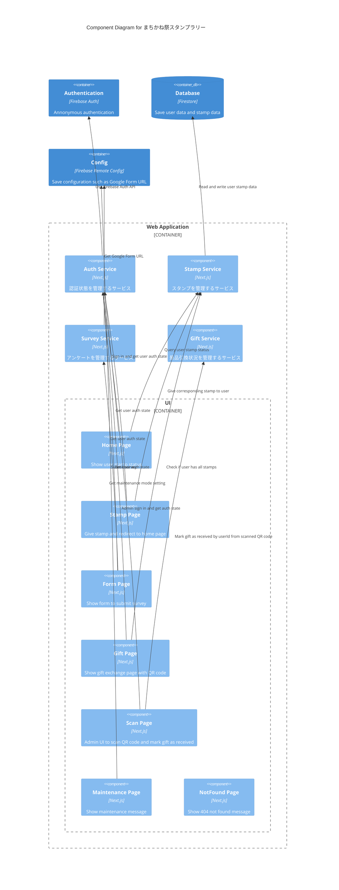

Status: draft
Authors: ゆにねこ
Reviewers: nagomu
Updated: 2025/10/11
# Objective
2025年まちかね祭展示のスタンプラリーシステムを開発する。
# Background
# Goals / Non-goals
## Goals
* ユーザーはWebサイトアクセス時に匿名認証する
* ユーザーは下記のときにスタンプを獲得できる
	* 受付でNFCタグを読み込んだ時
	* フォトブースでNFCタグを読み込んだ時
	* インタラクティブアートでNFCタグを読み込んだ時
	* ロボット展示でNFCタグを読み込んだ時
	* アンケートに回答した時
* ユーザーはスタンプ獲得状況をWebサイトで確認できる
* ユーザーはスタンプをすべて集めたら景品引換のページを表示できる
* ユーザーはAIフォトブースに画像をアップロードできる
* 管理者はパスワード認証でAdmin認証できる
* 管理者は Gift Page の QR コードを読み取って、ユーザーを景品受け取り済みにできる
* 来場者向けページは日本語・英語で同等の情報を表示する
* - 各ページはスタンプ取得〜景品受け取り導線で体感 1 秒以内の応答を保つ
## Non-goals
# Architecture
* Web Application は Firebase App Hosting に **fes2025.gdsc-osaka.jp** でホスティングする
* 来場者用のページにアクセスすると自動的に FIrebase Auth の匿名認証を行う.
	* 認証成功時に Firestore にユーザーデータを保存する
	* 認証ユーザーとFirestoreのデータは Next.js 上では Context と hooks で管理する
* NFCタグには事前に URL を登録しておき、URL にアクセスしたユーザーがスタンプを獲得できる
	* URL例: **https://fes2025.gdsc-osaka.jp/stamp?type=reception
* アンケートフォームは Web App 内で実装し、Submit 時に Google Form に回答結果を送信する
	* Google Form の URL は Firebase Remote Config で管理する
	* https://qiita.com/TKfumi/items/d8924f6ffa6e40675ce4
* アンケートでは以下の情報を収集する
	* userId: Firebase Auth の Annonymous Login で発行される UID. Input 自体は表示せず、 Google Form に送信するときに付与する.
	* AIフォトブースの満足度 (5段階評価)
	* インタラクティブアートの満足度 (5段階評価)
	* スタンプラリーの満足度 (5段階評価)
	* 自由記述欄
* アンケート回答後に Gift Page にアクセスすると、景品引換ページと QR コードを表示する
	* QRコードには userId 情報を含める
	* 運営が QR コードを読み取ると、当該ユーザーが景品受け取り済みになる
* Remote Config の障害レベルに応じて参加者ページは /maintenance に誘導する. Scan Page は例外とする.
## Physical Structure
* 展示会場
	* 受付
		* /stamp?token=(receptionのトークン) へのNFCタグを設置
	* フォトブース
		* /stamp?token=(photoboothのトークン) へのNFCタグを設置
	* インタラクティブアート
		* /stamp?token=(artのトークン) へのNFCタグを設置
	* ロボット展示
		* /stamp?token=(robotのトークン) へのNFCタグを設置
	* 出口
		* /stamp?token=(surveyのトークン) へのNFCタグを設置
		* 運営者がスマートフォン上で Scan Page からアンケート回答済みのユーザーの Gift Page のQR コードを読み取る
* 来場者の私物端末 (スマホ)
## Prohibitions
* API Routes の使用
## Diagram
### Component Diagram (C3)

### Code Diagram (C4)
```typescript
interface AuthService {
	signInAnonymously(): ResultAsync<User, FirebaseAuthException>;
	getCurrentUser(): User | null;
}
```

```typescript
interface StampService {
	getStampStatus(userId: string): ResultAsync<StampStatus, FirestoreException>;
	giveStamp(userId: string, stampType: StampType): ResultAsync<void, FirestoreException>;
}

type StampType = 'reception' | 'photobooth' | 'art' | 'robot' | 'survey';

interface StampStatus {
	reception?: Date;
	photobooth?: Date;
	art?: Date;
	robot?: Date;
	survey?: Date;
}
```

```typescript
interface SurveyService {
	submitSurvey(userId: string, responses: SurveyResponses): ResultAsync<void, SurveyError>;
}

interface SurveyResponses {
	photoBoothRating: number; // 1-5
	interactiveArtRating: number; // 1-5
	stampRallyRating: number; // 1-5
	comments?: string;
}
```
## Data Model
### Firestore
```yaml
users:
	(userId): # userId = Firebase Auth UID
		stamps: { # スタンプを獲得した日時
			reception?: Timestamp
			photobooth?: Timestamp
			art?: Timestamp
			robot?: Timestamp
			survey?: Timestamp
		}
		lastSignedInAt: Timestamp
		giftReceivedAt?: Timestamp
		createdAt: Timestamp
```
### Firebase Remote Config
```yaml
stamp_app_status: "online" | "degraded" | "maintenance"
stamp_app_message_ja: string
stamp_app_message_en: string
```
## Tech Stack
* Frontend: Next.js, shadcn/ui, Tailwind CSS, jotai, neverthrow
* Backend: なし
* BaaS: Firebase Auth, Firestore, Firebase App Hosting, Firebase Functions, Firebase Analytics
* Observability: Sentry（Performance + Error Trace）
* QRコード生成: qrcode.react
* QRコードスキャン: jsqr
## UI
### 用語
- ナビゲーション: `<link/>` による遷移
- リダイレクト: JavaScript による遷移
### Pages

| Page             | URL                        | Description                                                                                                                                                                                                                                                                                                                                            |
| ---------------- | -------------------------- | ------------------------------------------------------------------------------------------------------------------------------------------------------------------------------------------------------------------------------------------------------------------------------------------------------------------------------------------------------ |
| Home Page        | /                          | **アクセス方法**<br>Stamp Page からナビゲーション、または専用の NFC タグからアクセス<br><br>**UI要件**<br>来場者用ページ.<br>- スタンプラリーの枠を大きく表示 (5枠)<br>- 獲得済みのスタンプ枠には赤色のスタンプを表示<br>- スタンプ枠の下部に「アンケートに回答」ボタンと「景品を受け取る」ボタンを表示<br>- それぞれのボタンは初期状態で disabled<br>- スタンプ全獲得 & アンケート未回答 ->「アンケートに回答」のボタンを enabled<br>- スタンプ全獲得 & アンケート回答済 ->「景品を受け取る」のボタンを enabled<br><br>**ロジック**<br>再読み込み時にデータを再取得 |
| Stamp Page       | /stamp?token=(stamp_token) | **アクセス方法**<br>StampTypeごとにトークンを発行し、非公開の環境変数に保存する<br>スタンプごとに URL を作成し、NFCタグに記録する<br>NFCタグを読み取ったユーザーはこのページにアクセスする<br><br>**UI要件**<br>来場者用ページ.<br>- どのスタンプかを上部に表示<br>- 画面中央にスタンプ枠を表示<br>- ユーザーにスタンプを付与するアニメーションを再生<br>- データベースを更新してスタンプ付与<br>- アニメーション終了後に「スタンプ一覧を見る」のボタンを表示                                                                              |
| Form Page        | /form                      | **アクセス方法**<br>ホームページからナビゲーション<br><br>**UI要件**<br>来場者用ページ.<br>- 戻るボタン、フォーム、回答を送信ボタンを表示<br>- React Hook Form + shadcn Form でフォームを実装<br>- 回答を送信ボタンを押すと Gift Page に遷移する                                                                                                                                                                                    |
| Gift Page        | /gift                      | **アクセス方法**<br>ホームページからナビゲーション、または Form Page からリダイレクト<br><br>**UI要件**<br>来場者用ページ.<br>- 報酬未取得 -> お礼メッセージと QR コードを表示<br>- 報酬取得済 -> お礼メッセージと報酬受け取り済みのメッセージを表示                                                                                                                                                                                              |
| Scan Page        | /scan                      | **アクセス方法**<br>URL直接入力<br><br>**UI要件**<br>管理者用ページ.<br>- 管理者アカウントで未ログイン -> メールアドレスとパスワードフォームを表示<br>- 管理者アカウントでログイン済 -> QRコードスキャナーを表示<br><br>QRコードを読み取るとダイアログでメッセージを表示<br>- (userId) に景品を渡してください<br>- (userId) は既に景品を受け取っています<br>- 不正な QR コードです                                                                                                           |
| Maintenance Page | /maintenance               | **アクセス方法**<br>Admin用のページ (Scan Page) 以外からリダイレクト<br><br>**UI要件**<br>メンテナンス終了予定時刻、お詫びメッセージ、運営のSNSアカウントへのリンクを表示                                                                                                                                                                                                                                           |
| NotFound Page    | /404                       | **アクセス方法**<br>Adminのみログインできるページに未認証のユーザーがアクセスした場合にリダイレクト<br><br>**UI要件**<br>404 Not Found のメッセージと「Home Page に戻る」のボタンを表示                                                                                                                                                                                                                                |

# Security Considerations
## Threat Model
## Authentication & Authorization
* ユーザー認証にはFirebase Authの匿名認証を使用する
## Data Protection
* Firestore Security Rules で匿名認証したユーザーが自分のデータのみ読み書きできるようにする
# Privacy Considerations
## Data Minimization & Purpose Limitation
## Transparency and User Control
## Data Handling and Processing
## Data Sharing and Third Parties
## Compliance
# Open Issues
* アンケートについて、Google Form の非公式 API (?) を使うのが難しければ、GAS の `doPost` からのスプシ追記でも良いのでは？
	* GAS だと同時に回答が来たときの競合の処理とかが面倒くさいのかな？
* `/gift` の部分も NFC でやりたい
	* 来場者が NFC タグに触れると、受け取り済みにする API を叩く
* スタンプ取得後の画面遷移ボタンは自動化してもいいかも？
	* 自動で獲得済みスタンプに移動
* トークンを固定にすると、勝手に叩かれるかも？
	* 対して損害はないので、許容する